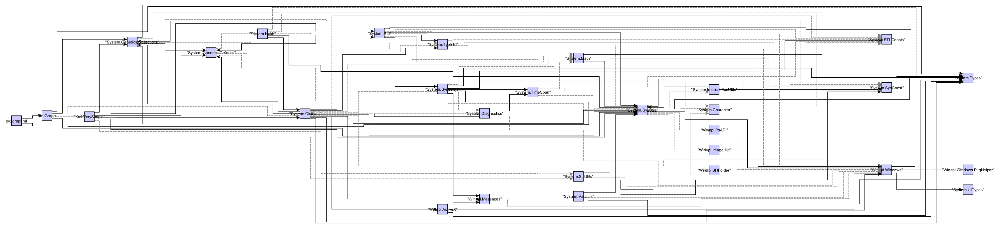

# gv2graphml
Converter of Delphi Compiler generated .gv graphs into yEd .graphml format.

## Requirements
 - Delphi 12
 - yEd (online or installed version)

## How to use
1. Open your Delphi project.
2. Open compilation settings (Ctrl+Shift+F11)
3. Navigate to Building > Delphi Compiler > Compiling
4. Locate the Other Options > "Additional options to pass to the compiler"
5. Fill in `--graphviz --graphviz-exclude=system.*;vcl.*;winapi.*` (this will skip System, VCL and WinApi units)
6. `ProjectName.gv` will be generated on project compilation
7. Call the `gv2graphml.exe ProjectName.gv ProjectName.graphml` to convert the graph
8. Use yEd to open the ProjectName.graphml
